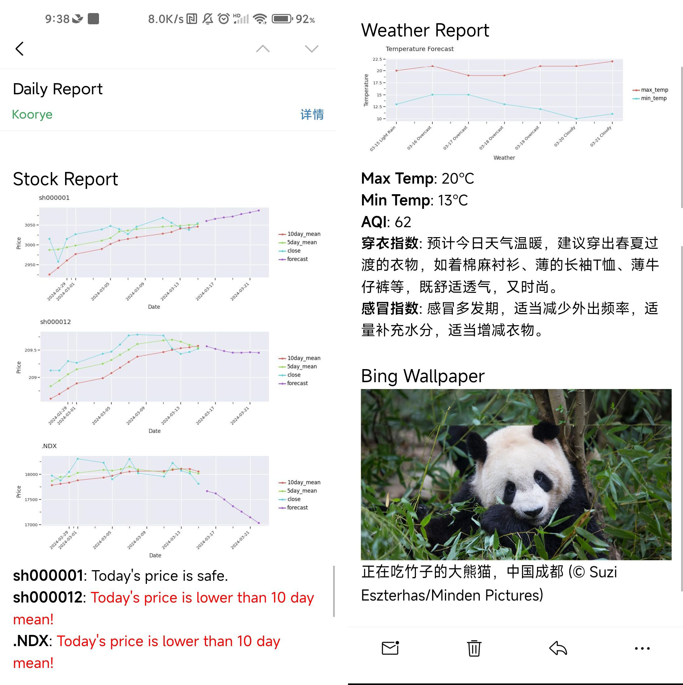

# Daily Helper

A customizable daily helper that is built in a modular manner and sends reminders in the form of emails.

## Support functions

1. **Stock/Index Helper**: Record recent stock/index trend information and predict future trend (not accurate).
2. **Weather Helper**: Report current day weather information and forecast future weather conditions.
3. **Bing Wallpaper Helper**: Send Bing wallpapers daily.
4. **Mail Helper**: Send report to your email.

## How to use

1. install requirements.txt `pip install -r requirements.txt`
2. Copy `config.py.template` into `config.py`.
3. Fill in your own email username, password, host, etc. in MailHelper.
4. Fill in your own python path/repo path in `daily_helper.bat` and `daily_helper_slient.vbs`.
5. Create `daily_helper.bat` shortcut, then move it into `C:\ProgramData\Microsoft\Windows\Start Menu\Programs\StartUp` directory. If you want to run silently, use `daily_helper_slient.vbs` in the same way.
6. This program will run when your PC startup, enjoy it!

**Why not github action?** Frequently use github action to crawl network information and send email may cause your repo **BANNED**. If you have your own server, you can deploy this repo on your server :).

## How to customize

1. Write your own helper, you can extend base helpers like web helper or plot helper, this will make it easier to implement network requests, drawing, and more.
2. Register in `core/__init__.py`.
3. Write your own config.py, like `config.py.template`.

**Notice** Each helper should implement `result()` function, which accept previous helpers' results as input, then add new result in it and return.

## Future

1. Log system, better debug support.
2. more helpers.